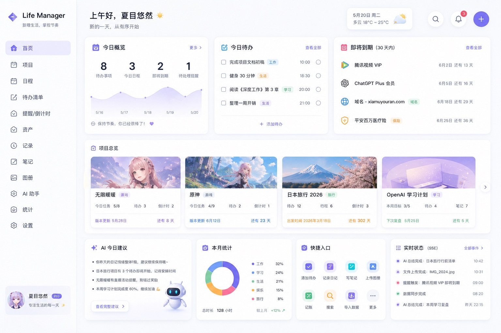
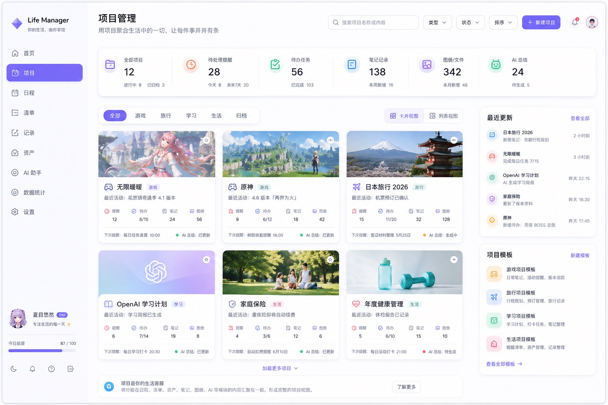
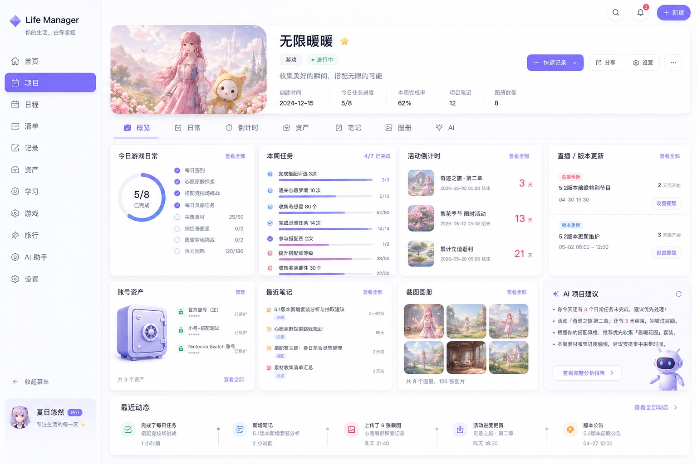
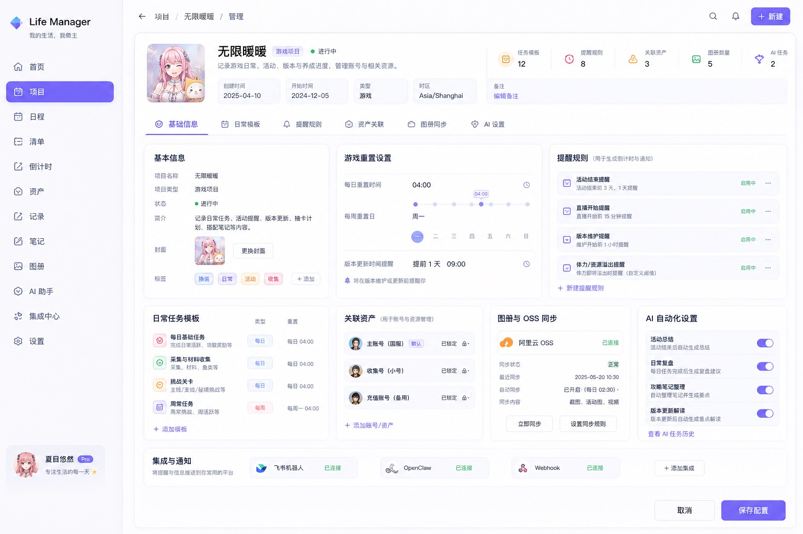
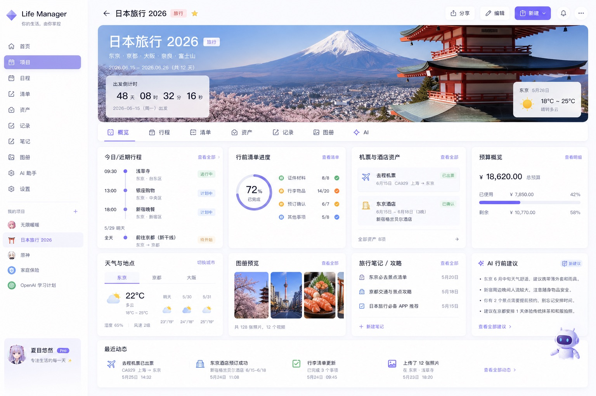
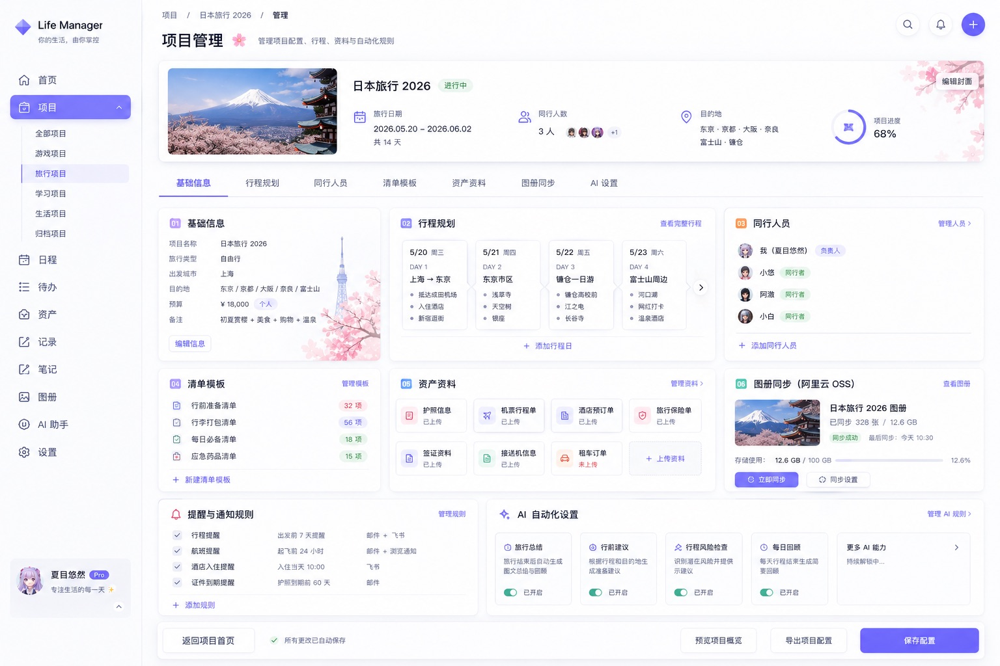

# FunMyLife

> 把生活变成可以被理解、被回顾、被 AI 协作的个人项目系统。

FunMyLife 是一个面向 AI 时代的个人生活管理产品。它不只是记录待办、日程和资料，而是帮助用户把生活中真正重要的事情组织成一个个“项目”：旅行、游戏、学习、健康、保险、搬家、人际关系、长期目标，都可以拥有自己的结构、时间线、资料库和智能助手。

在过去，个人生活数据常常散落在聊天记录、相册、备忘录、网页收藏、表格和脑子里。它们有价值，但没有结构；有回忆，但很难被检索；有经验，但无法持续复用。FunMyLife 想做的是把这些碎片整理成可持续生长的个人数据资产，让 AI 不只是回答问题，而是真正理解用户正在经历什么、计划什么、积累了什么。

当前仓库的核心模块是 **Life Manager**。它已经完成了一组高保真产品页面，用来验证“以项目为中心”的生活管理体验。

## 产品预览

| Life Manager 首页 | 项目管理 |
| --- | --- |
|  |  |

| 无限暖暖项目概览 | 无限暖暖项目配置 |
| --- | --- |
|  |  |

| 旅行项目概览 | 旅行项目配置 |
| --- | --- |
|  |  |

## 为什么做这个产品

多数生活管理工具把事情拆成待办、日历、笔记、文件或账单。拆开以后，每个工具都能解决一小块问题，但用户真正关心的往往不是某一条待办，而是一个完整事项的推进。

“日本旅行”不是几条待办，它包含目的地、预算、证件、机票酒店、行程、同行人、天气、照片和复盘。“无限暖暖”也不是一组备忘录，它包含日常任务、活动版本、账号资产、图册、素材收集和长期时间轴。

Life Manager 的出发点是：生活里的复杂事项应该被当成项目管理，而不是被拆散在不同工具里。

## AI 时代的数据价值

AI 真正有用的前提，是它能拿到有上下文、有结构、有时间关系的数据。

如果用户的数据只是零散文字，AI 只能做临时总结；如果用户的数据已经按项目沉淀，AI 就可以理解“这是一个长期游戏项目”“这是一次阶段型旅行”“这条记录属于某个版本活动”“这个提醒会影响明天的行程”。这时 AI 能做的就不只是聊天，而是帮用户做持续判断。

FunMyLife 希望沉淀三类个人数据价值：

| 数据价值 | 说明 |
| --- | --- |
| 当前上下文 | 用户现在关注什么、哪些项目正在推进、哪些事项需要行动 |
| 长期记忆 | 用户过去做过什么决定、完成过什么目标、留下过什么资料 |
| 可复用经验 | 一次旅行、一段学习、一个长期项目结束后，可以变成下一次的参考 |

这也是 Life Manager 要强调“项目、方案、功能块、时间轴”的原因。它不是为了把页面做复杂，而是为了让个人生活数据从一开始就拥有可理解的结构。

## 核心体验

**1. 用项目承载生活事项**

用户不是从空白表单开始，而是创建一个具体项目。项目可以是长期经营型，比如游戏、健康、学习、人际关系；也可以是阶段计划型，比如旅行、考试、搬家、装修。

**2. 用方案快速组织项目**

不同项目有不同关注点。游戏项目会更关注任务、活动、账号资产和版本时间线；旅行项目会更关注行程、预算、证件、地点和出行准备。方案负责给项目一个合适的默认结构。

**3. 用概览看到当下重点**

首页和项目概览不追求展示全部数据，而是回答一个问题：现在最值得注意什么。比如今天要完成哪些任务、哪个活动快结束、旅行还有几天出发、预算是否有风险。

**4. 用项目管理页调整规则**

日常页面负责使用，管理页负责配置。用户可以调整功能入口是否显示、摘要如何生成、提醒如何触发、时间轴记录哪些内容，让项目既有默认结构，也能长期个性化。

**5. 用时间轴沉淀变化**

很多生活数据的价值不是当下，而是回看。时间轴让一次项目的推进过程被留下来：完成了什么、错过了什么、为什么改计划、哪些资料值得下次复用。

**6. 让 AI 成为项目协作者**

AI 可以基于项目上下文生成建议、摘要、提醒和候选内容。它不应该替用户擅自写入敏感信息，而应该在明确边界内辅助整理、判断和复盘。

## 当前产品范围

当前 Life Manager 已经覆盖六个核心页面：

| 页面 | 路径 | 产品作用 |
| --- | --- | --- |
| Life Manager 首页 | `/life/home` | 总览生活项目、今日关注、近期变化和快捷入口 |
| 项目管理 | `/life/projects` | 管理不同生活项目的状态、类型和入口 |
| 无限暖暖项目概览 | `/life/project/infinity-nikki` | 长期经营型游戏项目样例 |
| 无限暖暖项目配置 | `/life/project/infinity-nikki/manage` | 游戏项目的功能块、摘要、提醒和时间轴规则 |
| 日本旅行项目概览 | `/life/project/japan-travel` | 阶段计划型旅行项目样例 |
| 日本旅行项目配置 | `/life/project/japan-travel/manage` | 旅行项目的行程、预算、资料和提醒规则 |

`/life` 仅作为兼容重定向，产品入口统一使用 `/life/home`。

## 产品模型

Life Manager 当前使用这套概念组织产品：

```text
项目 = 类型 + 周期属性 + 方案 + 功能块实例 + 用户数据
功能块实例 = 功能块 + 项目内配置
功能块 = 一个或多个能力的产品化组合
能力 = 底层可复用机制
```

简单理解：

- **项目** 是用户真正使用和维护的生活对象。
- **类型** 描述项目属于什么领域，比如游戏、旅行、学习、健康。
- **周期属性** 描述项目如何随时间推进，比如长期经营型或阶段计划型。
- **方案** 是创建项目时的默认搭法。
- **功能块** 是用户能看到和操作的产品入口，比如任务、行程、图册、时间轴。
- **功能块实例** 是某个功能块在具体项目里的配置。
- **用户数据** 是项目长期使用后沉淀下来的真实内容。

这套模型让 Life Manager 可以继续扩展更多生活场景，而不是每新增一个项目都重新设计一套页面。

## 适合的场景

| 场景 | Life Manager 可以做什么 |
| --- | --- |
| 长期游戏 | 管理日常、周常、活动版本、截图图册、账号资产和复盘 |
| 旅行计划 | 管理行程、清单、预算、证件、地点、天气、照片和归档 |
| 学习计划 | 管理阶段目标、资料、课程、练习、复盘和长期进度 |
| 健康管理 | 管理习惯、指标、提醒、检查记录和趋势回顾 |
| 家庭事务 | 管理保险、证件、维修、账单、联系人和重要资料 |
| 人际关系 | 管理重要日期、互动记录、礼物灵感和关系维护提醒 |

## 产品文档

| 文档 | 说明 |
| --- | --- |
| `docs/Life Manager 项目概念与方案设计.md` | 产品概念总控，解释 Life Manager 为什么按项目建模 |
| `docs/Life Manager 方案模板协议.md` | 方案、功能块实例、项目导航、摘要和 AI 边界协议 |
| `docs/Life Manager 网页开发规范.md` | 页面布局、共享组件和视觉规范 |
| `docs/落地改造计划.md` | 从高保真演示走向真实数据和后端模型的路线 |
| `docs/infinity-nikki-api.md` | 无限暖暖项目相关接口设计记录 |

## 开发者入口

这个仓库是一个前后端一体的产品原型：

```text
FunMyLife
├── admin-web/                  # 前端应用与 Life Manager 页面
├── fml-service/                 # Life Manager 轻量后端服务
├── admin-service/               # RuoYi-Vue-Plus 后台底座与历史服务
├── docs/                       # 产品文档、协议和 UI 图
└── README.md
```

前端 Life Manager 相关代码主要在：

```text
admin-web/src/views/
admin-web/src/components/life-manager/
admin-web/src/constants/life-manager/
admin-web/src/styles/css/life-high-fidelity.css
```

后端 Life Manager 相关代码已经独立到：

```text
fml-service/src/main/java/com/funmylife/fml/
fml-service/src/main/resources/application.yml
```

初始化 SQL 目前仍复用历史脚本：

```text
admin-service/script/sql/lm_life.sql
```

## 本地运行

基础环境：JDK 21、Maven、Node.js 20.19+、pnpm 10.5+、Docker。

启动数据库依赖：

```bash
cd admin-service/script/docker
docker compose up -d mysql
```

`fml-service` 默认连接 `localhost:3306/fml`，数据库账号密码通过 `FML_DB_USERNAME`、`FML_DB_PASSWORD` 覆盖；本地默认值是 `root/123456`。启动前需要创建 `fml` 数据库并导入 Life Manager 初始化 SQL。

```bash
mysql -uroot -p -e "create database if not exists fml default character set utf8mb4 collate utf8mb4_general_ci;"
mysql -uroot -p fml < admin-service/script/sql/lm_life.sql
```

启动 Life Manager 后端：

```bash
cd fml-service
mvn spring-boot:run
```

后端默认端口是 `8082`，接口统一使用 `POST + JSON body`，例如 `/life/project/detail`。

启动前端：

```bash
cd admin-web
pnpm install
pnpm dev
```

前端常见访问地址是 `http://localhost:9527`。本地联调 `fml-service` 时，建议在 `admin-web/.env.dev.local` 中设置：

```env
VITE_SERVICE_BASE_URL=http://localhost:8082
```

如果该文件仍指向远程服务或旧后台端口，需要先改回当前要联调的后端地址。

历史后台账号：

以下账号仅适用于后续需要启动 `admin-service` 管理后台的场景；`fml-service` 当前不包含登录和权限模块。

| 账号 | 密码 | 说明 |
| --- | --- | --- |
| `admin` | `admin123` | 超级管理员 |
| `test` | `666666` | 测试账号 |
| `test1` | `666666` | 测试账号 |

## 技术底座

FunMyLife 前端继承了 RuoYi-Plus-Soybean / Soybean Admin 的工程体系；Life Manager 后端已经从 RuoYi-Vue-Plus 后台服务中拆出，当前以 `fml-service` 作为独立轻量服务推进。

前端使用 Vue 3、TypeScript、Vite、Naive UI、Pinia、UnoCSS 和 pnpm workspace。`fml-service` 使用 Spring Boot 3、JDK 21、MyBatis-Plus、MySQL、Lombok 和 Maven；`admin-service` 仍保留 RuoYi-Vue-Plus 的系统管理、OSS、SSE、任务调度等历史能力，后续按需要再接入或隐藏。

参考项目：

- [RuoYi-Vue-Plus](https://github.com/dromara/RuoYi-Vue-Plus)
- [RuoYi-Plus-Soybean](https://github.com/m-xlsea/ruoyi-plus-soybean)
- [Soybean Admin](https://github.com/soybeanjs/soybean-admin)

## License

本仓库基于上游开源项目二次开发。具体授权请以 `admin-service/LICENSE`、`admin-web/LICENSE` 及上游项目协议为准。
